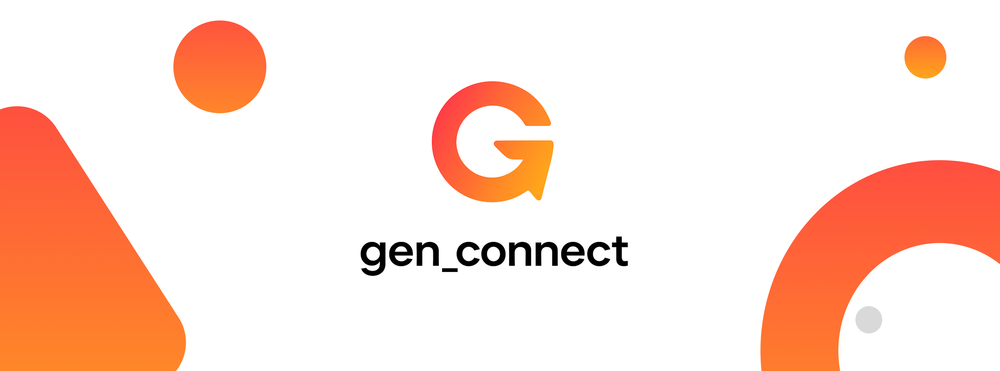

gen_connect is a modular Dart/Flutter package for integrating any AI model/provider (OpenAI, Gemini, Anthropic, Meta, Grok, DeepSeek, PaLM, and custom models) into your app with type-safe, scalable connectors and unified error handling.

## Supported Models by Provider

### OpenAI

Models: gpt4, gpt3, gpt4-turbo, gpt-vision, gpt-image-1, whisper, dall-e, code-davinci, etc.
Methods: sendPrompt, sendImage, sendAudio, sendCode

### Gemini

Models: gemini-1.5-pro, gemini-1.5-flash, gemini-2.5-pro, gemini-pro-vision, etc.
Methods: sendPrompt, sendImage, sendAudio

### Meta

Models: llama2, llama3, llama-guard, etc.
Methods: sendPrompt, sendImage

### Claude

Models: claude-2, claude-3, claude-1, etc.
Methods: sendPrompt

### Anthropic

Models: claude-3-opus, claude-3-sonnet, claude-3-haiku, etc.
Methods: sendPrompt

### DeepSeek

Models: deepseek-chat, deepseek-coder, deepseek-vision, etc.
Methods: sendPrompt, sendCode, sendImage

### PaLM

Models: palm2, codey, chirp, etc.
Methods: sendPrompt, sendCode, sendAudio

### Grok

Models: grok-1, grok-1.5, grok-2.5, etc.
Methods: sendPrompt, sendCode

## Features

- Integrate multiple AI providers and models (text, image, audio, code, video)
- Type-safe enums for all models/providers
- Modular connectors for each use case
- Unified error and exception handling
- Easy extension for new models/providers
- Runtime and compile-time feature restriction
- Custom model support for organizations

## Getting started

### Prerequisites

- Dart >= 3.8.1
- Flutter >= 1.17.0
- You must add API keys for each provider you want to use (OpenAI, Gemini, Anthropic, Meta, etc.)
- Store keys securely (e.g., using environment variables or a secrets manager)

## Usage

## Connectors & Usage

This package provides modular connectors for each AI provider and use case. Each connector is type-safe and restricts features to supported models only. Below are examples for all available methods per provider and their models:

### OpenAI Connector

Models: gpt4, gpt3, gpt4-turbo, gpt-vision, gpt-image-1, whisper, dall-e, code-davinci

## Centralized Connector Management

You can manage all your AI connectors using `GenConnectManager`:

```dart
import 'package:gen_connect/gen_manager.dart';
import 'package:gen_connect/connectors/openai/openai_connector.dart';
import 'package:gen_connect/connectors/gemini/gemini_connector.dart';
// ...other imports...

final manager = GenConnectManager.getInstance();
manager.addConnector(OpenAIConnector(apiKey: 'YOUR_OPENAI_KEY'));
manager.addConnector(GeminiConnector(apiKey: 'YOUR_GEMINI_KEY'));
// Add other connectors...

final openai = manager.openai;
final gemini = manager.gemini;
// Use connectors as shown in the examples above
```

```dart
import 'package:gen_connect/connectors/openai/openai_connector.dart';
final openai = OpenAIConnector(apiKey: 'YOUR_OPENAI_KEY');
final chatResponse = await openai.sendPrompt('Chat with GPT-4');
final imageResponse = await openai.sendImage('path/to/image.png');
final audioResponse = await openai.sendAudio('path/to/audio.wav');
final codeResponse = await openai.sendCode('print("Hello World")');
```

### Gemini Connector

Models: gemini-1.5-pro, gemini-1.5-flash, gemini-2.5-pro, gemini-pro-vision

```dart
import 'package:gen_connect/connectors/gemini/gemini_connector.dart';
final gemini = GeminiConnector(apiKey: 'YOUR_GEMINI_KEY');
final textResponse = await gemini.sendPrompt('Gemini text');
final imageResponse = await gemini.sendImage('path/to/image.png');
final audioResponse = await gemini.sendAudio('path/to/audio.wav');
```

### Meta Connector

Models: llama2, llama3, llama-guard

```dart
import 'package:gen_connect/connectors/meta/meta_connector.dart';
final meta = MetaConnector(apiKey: 'YOUR_META_KEY');
final textResponse = await meta.sendPrompt('Meta text');
final imageResponse = await meta.sendImage('path/to/image.png');
```

### Anthropic Connector

Models: claude-3-opus, claude-3-sonnet, claude-3-haiku

```dart
import 'package:gen_connect/connectors/anthropic/anthropic_connector.dart';
final anthropic = AnthropicConnector(apiKey: 'YOUR_ANTHROPIC_KEY');
final textResponse = await anthropic.sendPrompt('Anthropic text');
```

### DeepSeek Connector

Models: deepseek-chat, deepseek-coder, deepseek-vision

```dart
import 'package:gen_connect/connectors/deepseek/deepseek_connector.dart';
final deepseek = DeepSeekConnector(apiKey: 'YOUR_DEEPSEEK_KEY');
final chatResponse = await deepseek.sendPrompt('DeepSeek chat');
final codeResponse = await deepseek.sendCode('def foo(): pass');
final imageResponse = await deepseek.sendImage('path/to/image.png');
```

### PaLM Connector

Models: palm2, codey, chirp

```dart
import 'package:gen_connect/connectors/palm/palm_connector.dart';
final palm = PalmConnector(apiKey: 'YOUR_PALM_KEY', model: PalmModel.palm2);
final textResponse = await palm.sendPrompt('PaLM text');
final codeResponse = await palm.sendCode('let x = 1;');
final audioResponse = await palm.sendAudio('path/to/audio.wav');
```

### Grok Connector

Models: grok-1, grok-1.5, grok-2.5

```dart
import 'package:gen_connect/connectors/grok/grok_connector.dart';
final grok = GrokConnector(apiKey: 'YOUR_GROK_KEY');
final textResponse = await grok.sendPrompt('Grok text');
final codeResponse = await grok.sendCode('SELECT * FROM users;');
```

### Custom Model Connector

Models: Any custom model name

```dart
import 'package:gen_connect/connectors/custom/custom_model_connector.dart';
import 'package:gen_connect/enums/models.dart';
final custom = CustomModelConnector(
  endpoint: 'https://your-model-endpoint',
  apiKey: 'YOUR_CUSTOM_KEY',
  model: Models.OPENAI,
);
final customResponse = await custom.sendPrompt('Custom model test');
final customImageResponse = await custom.sendImage('path/to/image.png');
final customAudioResponse = await custom.sendAudio('path/to/audio.wav');
final customCodeResponse = await custom.sendCode('echo "Hello"');
final customVideoResponse = await custom.sendVideo('path/to/video.mp4');
```

See `/example` for more advanced usage and all available use-case connectors.

## Advanced Usage

See `/example/main.dart` for how to:

- Instantiate and register multiple connectors
- Select and use different model versions via enums
- Call usecases (text, image, audio, code, etc.) for each provider
- Handle errors and responses in a unified way

## Tips & Precautions

- **Secure your API keys:** Never hardcode keys in your source code. Use environment variables or a secrets manager.
- **Check model capabilities:** Only use features supported by each model/provider. The connectors enforce this, but always consult provider docs for limits and costs.
- **Handle errors gracefully:** All connectors use unified error handling. Catch exceptions and show user-friendly messages.
- **Monitor usage and costs:** AI APIs may incur costs. Track usage and set limits as needed.
- **Keep dependencies updated:** Regularly update this package and your dependencies for security and new features.
- **Respect provider terms:** Follow the terms of service and usage policies for each AI provider.

## Contributing & Support

- Issues and feature requests: [GitHub Issues](https://github.com/your-org/gen_connect/issues)
- Pull requests welcome!
- See CHANGELOG.md for release history.

## License

MIT
